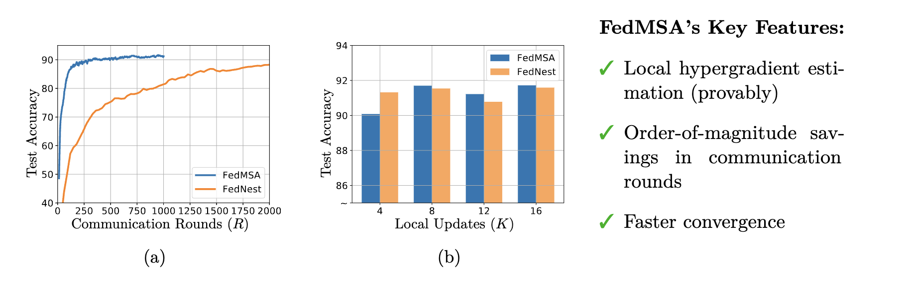

# FedMSA

This directory contains source code for evaluating federated bilevel learning with different optimizers on various models and tasks.  In federated bilevel learning, we consider the following nested optimization problem as depicted in Figure 1:

The objective is to find the optimal values of ${x}$, ${z}^{1,}$, $\ldots$, ${z}^{N,}$ such that
$$\sum_{m=1}^M P^{m}({x},{z}^{1}, \ldots, z^N)=0, \quad \sum_{m=1}^M S^{m,n} (z^{n-1},z^{n})=0, \quad \text{for all}  \quad n \in [N].$$
Here, $$P=\sum_{m=1}^M P^m, \quad S^n:=\sum_{m=1}^M S^{m,n}  \quad \text{for all} \quad  n \in [N].$$

The code was originally developed for the paper
"Federated Multi-Sequence Stochastic Approximation withLocal Hypergradient Estimation" ([arXiv link](https://arxiv.org/submit/4930672)).
 
The federated code is adopted from [FedNest](https://github.com/ucr-optml/FedNest) and [shaoxiongji's](https://github.com/shaoxiongji/federated-learning). 

- The bilevel implenmentation follows the algorithm of 
[*Optimizing Millions of Hyperparameters by Implicit Differentiation (Jonathan Lorraine, Paul Vicol, David Duvenaud)*](https://arxiv.org/abs/1911.02590). 
- The parametric loss tuning experiments on imbalanced dataset follows the loss function design idea of 
[*AutoBalance: Optimized Loss Functions for Imbalanced Data (Mingchen Li, Xuechen Zhang, Christos Thrampoulidis, Jiasi Chen, Samet Oymak)*](https://openreview.net/pdf?id=ebQXflQre5a), but we only use MNIST in imbalanced loss function design. 
- The algorithm is also implemented on a (synthetic) federated multilevel stochastic composite optimization problems.  Our example is specifically chosen from the field of risk-averse stochastic optimization, which involves multilevel stochastic composite optimization problems. It can be formulated as follows: 
$$\min_{x}{\mathbb{E}[U({x}, \xi)]+\lambda \sqrt{\mathbb{E}[\max(0, U({x},\xi)-\mathbb{E} [U({x},\xi)])^2]}}.$$

Note: The scripts will be slow without the implementation of parallel computing. 

# Requirements
python>=3.6  
pytorch>=0.4

# Reproducing Results on FL Benchmark Tasks

## FedBLO 

## FedBLO: Loss Function Tuning on Imbalanced Dataset
code is adopted from FedNest, check the reproduce folder to reproduce the result.

## FedMCO 
 Code is in the jupyter notebook file, fedMCO_stochastic_final.ipynb.

More arguments are avaliable in [options.py](utils/options.py). 
